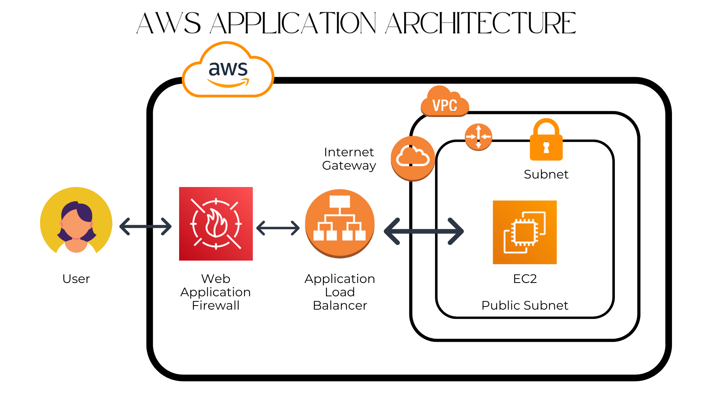

# Cloud Web Security using AWS WAF

### Project Explanation and Objective

#### Project Overview

This project demonstrates a secure and scalable web application built using AWS services such as EC2, Application Load Balancer (ALB), and AWS WAF. The main focus is to control and filter incoming traffic while ensuring high availability.

#### Key Components and Features

1. **EC2 Instance**
   Hosts the web application and handles incoming user requests.

2. **Application Load Balancer (ALB)**
   Distributes traffic across instances and ensures reliability and fault tolerance.

3. **AWS WAF**
   Filters HTTP/HTTPS requests and controls access using rules like IP blocking, allowing, and CAPTCHA.

#### Objective

* **Security**
  Protect the application by filtering unwanted or malicious traffic.

* **Traffic Control**
  Manage incoming requests using rule-based filtering (block, allow, CAPTCHA).

* **Scalability**
  Ensure the application can handle varying traffic loads efficiently.

#### Why Use These AWS Services?

1. **AWS EC2**
   Provides flexible and scalable compute resources for hosting the application.

2. **ALB**
   Ensures smooth traffic distribution and high availability.

3. **AWS WAF**
   Adds an advanced security layer by controlling and monitoring web traffic.

#### Conclusion

This project demonstrates how AWS services can be combined to build a secure, scalable, and reliable web application with effective traffic filtering at the application layer.

